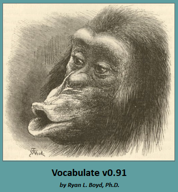
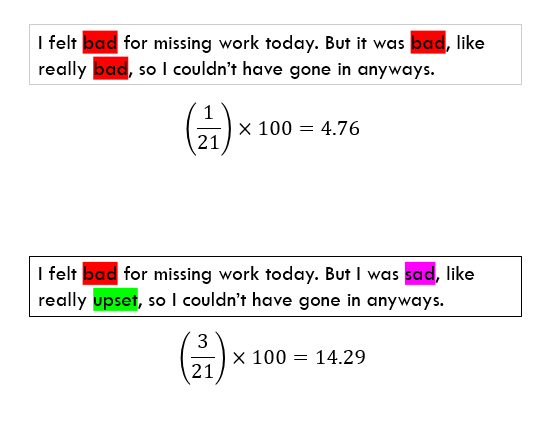

# Vocabulate

This page contains the source code for Vocabulate, the software used for:

Vine, V., Boyd, R. L., & Pennebaker, J. W. (2020). Natural emotion vocabularies as windows on distress and well-being. Nature Communications, 11(1), 4525. https://doi.org/10.1038/s41467-020-18349-0

Note that the software can be compiled from the code on this page, or you can download and run the executable for the program from the [software's website](https://www.ryanboyd.io/software/vocabulate/) or directly from this [GitHub repository](https://github.com/ryanboyd/Vocabulate/releases/tag/v0.91). 

Note that this software is no longer in active development, although we plan to make the software slightly more obvious in the near future (e.g., with an instructional YouTube video). The functionality of Vocabulate has been folded into some soon-to-be-released software: [BUTTER](https://www.butter.tools/).

# Interpreting Vocabulate Output

* **WC: Word Count**
  * Total number of words

* **TC_Raw: Token Count, Raw**
  * Total number of tokens. This is like word count, but separately includes things like punctuation, etc.

* **TTR_Raw: Type-Token Ratio, Raw**
  * Type-Token ratio is just the number of unique tokens divided by the total number of tokens (a standard measure of vocabulary spread in linguistics). This is the TTR on the raw tokens

* **TC_Clean: Token Count, Clean**
  * Token count after stop words are removed from text.

* **TTR_Clean: Type-Token Ratio, Clean**
  * TTR, but calculated after stop words have been removed

* **TC_NonDict: Token Count, Non-Dictionary Words**
  * Total number of tokens that were not captured by the loaded vocabulate dictionary

* **TTR_NonDict: Type-Token Ratio of Non-Dictionary Words**
  * This is the TTR calculated on the vocabulary that is not captured by your dictionary. Can be thought of as a control variable: you may want to control for TTR in your statistical models but without cross-contamination from your dictionary words

* **DictPercent: Percentage of Dictionary Words**
  * Total percent of your text that was captured by the loaded dictionary

* **[CategoryName]_CWR: Concept-Word Ratio**
  * This the the number of unique concepts (e.g., happiness, joy, wonderment) from any given category (e.g., positive affect), divided by word count. This is the critical measure used in our publication. An example of how this measure would be calculated:
  
 
* **[CategoryName]_CCR: Concept-Category Ratio**
  * This is the total number of concepts for the category divided by the total number of times the category was invoked in a given text. For example, the concepts "happy, joy, wonderful" gives the positive emotion CCR score 100% (3/3). The concepts "happy, happy, happy" result in a positive CCR score of 33% (1 unique concept divided by 3 invocations of the positive emotion category). Note that this score is vastly more sensitive to tiny perturbations than the CWR score.

* **[CategoryName]_Count**
  * Number of words belonging to the specified category found within the text.

* **[CategoryName]_Unique**
  * Number of unique words belonging to the category found within the text. Dividing this score by Word Count then multiplying by 100 results in the CWR score. Diving this word by the "Count" variable from the same category results in the CCR score.
